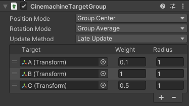
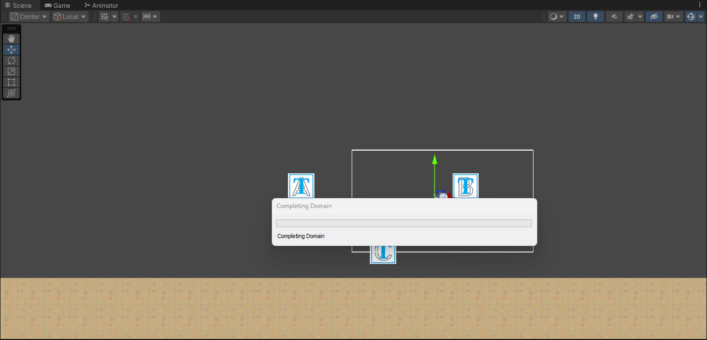
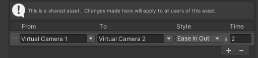

# Fundamentos del desarrollo de videojuegos
### Diego Herrera Mendoza
Cámara

1. Instalar el paquete CineMachine y configurar 2 cámaras virtuales con diferentes zonas de seguimiento al jugador. Mostar el efecto mediante un gif animado. 

---
2. Define un área de confinamiento diferente para cada una de las dos cámaras de la tarea anterior. Realiza una prueba de ejecución con el correspondiente gif animado que permita ver las diferencias.

---

3. Agrega varios sprites en la escena que estén realizando un movimiento (mínimo 3). Genera una cámara adicional que le haga el seguimiento a dichos objetos.

4. Agrega 2 sprites adicionales en la escena que estén realizando un movimiento Genera una cámara adicional que le haga el seguimiento a dichos objetos, cada uno con un peso en la importancia del seguimiento diferente.

---

5. Implementar un zoom a la cámara del jugador que se controle con las teclas w-s

Scripts: [Zoom](scripts/Zoom.cs)

---

6. Seleccionar un conjunto de teclas que permitan hacer el cambio entre dos cámaras . (Habilitar/Deshabilitar el gameobject de la cámara virtual)

Scripts: [ChangeCamera](scripts/ChangeCamera.cs)

---

7. Crear un script para activar la cámara lenta cuando el personaje entre en colisión con un elemento de la escena que elijas para activar esta propiedad. 
Crear un script para activar la cámara rápida cuando el personaje entre en colisión con un elemento de la escena que elijas para activar esta propiedad.

Scripts: [FastCam](scripts/FastCam.cs), [SlowCam](scripts/SlowCam.cs)

---

8. Crear un script para intercambiar la cámara activa, una estará confinada y la otra no,  cuando el personaje entre en colisión con un elemento de la escena que elijas para activar esta propiedad. 

Scripts: [ChangeCameraOnEvent](scripts/ChangeCamOnEvent.cs)

---

